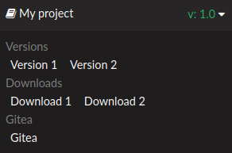

# sphinx-flyout

**sphinx-flyout** - это расширение [Sphinx](https://www.sphinx-doc.org/en/master/)
для автоматической сборки нескольких версий сайта и
генерации [flyout-меню](https://docs.readthedocs.io/en/stable/flyout-menu.html) 

## Использование

### Установка

```bash
pip install git+https://github.com/irsural/sphinx-flyout@multiversion
```

Расширение добавляется в файл конфигурации sphinx (**conf.py**), так же как и другие расширения sphinx:

```python
extensions = [
    ...,
    'flyout_multiversion',
    ...
]
```

### Настройка

У расширения есть 5 параметров, задаваемых переменными в **conf.py**.

#### ``fmv_flyout_header``

Заголовок меню. По умолчанию - название проекта **Sphinx**

#### ``fmv_flyout_repository``

Строка со ссылкой на репозиторий проекта. По умолчанию пустая,
а раздел **Репозиторий** не отображается

#### ``fmv_flyout_host``

Ссылка на хостинг сайта. Автоматически вставляется в нижеупомянутые ссылки. 
В случае, когда ссылка задаётся без протокола (http или https), ей автоматически
присваивается протокол https. **Обязательный параметр**

#### ``fmv_flyout_downloads``

Список с форматами документации проекта, доступными для загрузки 
(`html`, `pdf` и т.д.) .

Во время работы расширения ссылки автоматически преобразуются в следующий формат:

`html: fmv_flyout_host / fmv_flyout_header / download / html`

По умолчанию пуст, а раздел **Загрузки** не отображается

#### ``fmv_branch_whitelist``

Список с названиями веток репозитория, которые необходимо собрать. Ссылки на 
эти ветки добавляются в flyout-меню

По умолчанию - `["master"]`

#### ``fmv_flyout_branch_list``

Список с названиями веток проекта.

Во время работы расширения ссылки автоматически преобразуются в следующий формат:

`ветка1: fmv_flyout_host / fmv_flyout_header / heads / ветка1`

По умолчанию пуст.

В случае, если в обоих списках есть одинаковая запись, она не дублируется.

Если оба списка веток пусты, то раздел **Ветки** не отображается.

#### ``fmv_tag_whitelist``

Список с названиями тэгов проекта, которые необходимо собрать. Ссылки на 
эти тэги добавляются в flyout-меню.

По умолчанию - `["release"]`

#### ``fmv_flyout_tags``

Список с названиями собранных тэгов проекта.

Во время работы расширения ссылки автоматически преобразуются в следующий формат:

`тэг1: fmv_flyout_host / fmv_flyout_header / tags / тэг1`

По умолчанию пуст.

В случае, если в обоих списках есть одинаковая запись, она не дублируется.

Если оба списка тэгов пусты, то раздел **Тэги** не отображается


### Использование

Для сборки нескольких версий требуется запустить установленный скрипт расширения

``` bash
python3 -m flyout_multiversion путь_до_папки_исходников путь_до_папки_конечной
```

К команде можно применять все те же флаги, что и к обычной сборке Sphinx. 
Эти флаги будут применены для сборки всех веток и тэгов из соответствующих 
параметров **conf.py** 
## Пример

Содержимое **conf.py**:
```python
fmv_flyout_header = "My project"
fmv_flyout_repository_link = "https://gitea.example.com/my/project"

fmv_flyout_host = "example.com"
fmv_flyout_downloads = ["html", "pdf"]

fmv_tag_whitelist = ["release"]
fmv_flyout_tags = ["t2"]

fmv_branch_whitelist = ["master"]
fmv_flyout_branches = ["b1", "master"]
```

При запуске `python3 -m flyout_multiversion project_path build_path` будут
собрана ветка `master` и тэг `release`, и помещены соответственно в 
`build_path/tags/release` и `build_path/branches/master`

Вид сгенерированного меню:



Ссылки **Ветки** ведут на `https://example.com/My%20project/branch/b1` и `https://example.com/My%20project/branch/master`

Ссылки **Тэги** ведут на `https://example.com/My%20project/tag/t2` и `https://example.com/My%20project/tag/release`

Ссылки **Загрузки** ведут на `https://example.com/My%20project/download/html` и `https://example.com/My%20project/download/pdf`

Ссылка **Посмотреть** ведёт на `https://gitea.example.com/my/project`