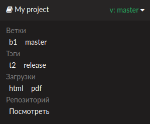

# sphinx-flyout

**sphinx-flyout** - это расширение [Sphinx](https://www.sphinx-doc.org/en/master/)
для автоматической генерации [flyout-меню](https://docs.readthedocs.io/en/stable/flyout-menu.html) 

## Использование

### Установка

```bash
pip install sphinx-flyout
```

Расширение добавляется в файл конфигурации sphinx (**conf.py**), так же как и другие расширения sphinx:

```python
extensions = [
    ...,
    'sphinx_flyout',
    ...
]
```

### Настройка

У расширения есть 6 параметров, задаваемых переменными в **conf.py**.

#### ``sphinx_flyout_current_version``

Строковое значение версии в меню. По умолчанию - `1.0`

#### ``sphinx_flyout_header``

Заголовок меню. По умолчанию - "Flyout"

#### ``sphinx_flyout_gitea``

Словарь структуры `{текст1: ссылка1, текст2: ссылка2, ...}` 
со ссылками на репозиторий проекта. По умолчанию пуст, 
а раздел **Gitea** не отображается 

#### ``sphinx_flyout_host``

Ссылка на хостинг сайта. Автоматически вставляется в нижеупомянутые ссылки. 
По умолчанию - `http://0.0.0.0:8000`

#### ``sphinx_flyout_downloads``

Словарь структуры `{текст1: ссылка1, текст2: ссылка2, ...}`
со ссылками на загрузки проекта.

Во время работы расширения ссылки автоматически преобразуются в следующий формат:

`{текст1: sphinx_flyout_host / download / ссылка1, текст2: sphinx_flyout_host / download / ссылка2, ...}`

По умолчанию пуст, а раздел **Downloads** не отображается

#### ``sphinx_flyout_versions``

Словарь структуры `{текст1: ссылка1, текст2: ссылка2, ...}`
со ссылками на версии проекта.

Во время работы расширения ссылки автоматически преобразуются в следующий формат:

`{текст1: sphinx_flyout_host / ver / ссылка1, текст2: sphinx_flyout_host / ver / ссылка2, ...}`

По умолчанию пуст, а раздел **Versions** не отображается

## Пример

Содержимое **conf.py**:
```python
sphinx_flyout_current_version = "1.0"
sphinx_flyout_header = "My project"
sphinx_flyout_gitea = {
    "Gitea": "https://gitea.example.com/my/project"
}
sphinx_flyout_host = "https://example.com"
sphinx_flyout_downloads = {
    "Download 1": "download1.zip",
    "Download 2": "download2.zip"
}
sphinx_flyout_versions = {
    "Version 1": "1.0",
    "Version 2": "2.0"
}
```

Вид сгенерированного меню:



Ссылка **Gitea** ведёт на `https://gitea.example.com/my/project`

Ссылки **Versions** ведут на `https://example.com/ver/1.0` и `https://example.com/ver/2.0`

Ссылки **Downloads** ведут на `https://example.com/download/download1.zip` и `https://example.com/download/download2.zip`